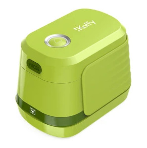
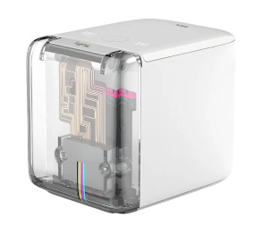

MBrush2 Printer SDK
=======================================
(Legacy MBrush / PrinCube models are in the maintenance branch)

Chinese Version: [中文文档](./Readme_zh.md)

1. [Communication Interface](#communication-interface)
2. [Mainboard Communication](#mainboard-communication)
3. [Print Position Description](#print-position-description)
4. [Print Status Description](#print-status-description)
5. [CDBUS GUI Tool](#cdbus-gui-tool)
6. [Image Conversion and Transfer Web Demo](#image-conversion-and-transfer-web-demo)
7. [Command-Line Conversion Tool](#command-line-conversion-tool)


Supported models:
 - HK24<br>
   
 - MBrush2<br>
   
 - HK14<br>
   (Upcoming)


## Communication Interface

This serial protocol is used for the printer RS-485 interface and USB-CDC serial port.

Base protocol: [CDNET Intro and Demo](https://github.com/dukelec/cdnet/wiki/CDNET-Intro-and-Demo)

Packets can also be forwarded to the RS-485 bus via Bluetooth or Wi-Fi: [CD-ESP](https://github.com/dukelec/cd_esp)


Type-C pinout:


### USB Interface
 - USB speed: High-speed (some models: Full-speed)
 - Driver: Driverless on all platforms
 - CDC baud rate: ignored (any value allowed)
 - DTR must be enabled to communicate
 - Address 0x10: mainboard, 0x20: BLE board (proxied by mainboard, uses temporary port bit4)
 - Models with encoder connector: Type-C is not reversible

### RS-485 Interface
 - Default dual speed: 2 Mbps & 20 Mbps (UART controller: [CDCTL01A](https://dukelec.com/en/download.html))
 - Can be configured to single speed for compatibility with legacy RS-485 hardware
 - Custom models may use 50 Mbps interface chips
 - Multi-master design:
   * BLE board may actively report key events
   * Mainboard may actively report print status
   * Bus arbitration prevents collisions automatically
 - Inside the printer, only the RS-485 end has two 330 Ω pull resistors
 - Termination resistor is not populated by default
 - Some models use TTL between BLE and mainboard:
   * Address 0x20 is still accessible via RS-485
   * Mainboard proxies automatically

### Encoder Interface
 - ENC+ / ENC- default: A/B quadrature encoder (ENC+: A, ENC-: B)
 - Can be configured as STEP / DIR input (ENC+: STEP, ENC-: DIR)
 - Signal level: 3.3 V


## Mainboard Communication

Supported CDNET functional ports — all are general-purpose except the last one:
 - #01: Device information query
 - #05: Parameter table read/write
 - #08: IAP firmware upgrade
 - #09: Print debug reporting
 - #0A: Waveform debug reporting
 - #14: Print file DPT transfer

Parameter table (read/write via port #05; `F`: retained after power-off, `!`: takes effect after reboot):

<table>
<tr> <th>Addr</th>   <th>Name</th>              <th>Attr</th>   <th>Type</th>   <th>Default</th>
     <th>Description</th>
</tr>
<tr> <td>0x0000</td> <td>magic_code</td>        <td>R/W</td>    <td>u16</td>    <td>0xcdcd</td>
     <td>Fixed value to check if flash contains a valid register table</td>
</tr>
<tr> <td>0x0002</td> <td>conf_ver</td>          <td>R/W</td>    <td>u16</td>    <td>0x0200</td>
     <td>Register table version: high byte: major, low byte: minor</td>
</tr>
<tr> <td>0x0004</td> <td>conf_from</td>         <td>R</td>      <td>u8</td>     <td>0</td>
     <td>
        0: Default<br>
        1: Flash-stored table<br>
        2: Default from bt_mac onwards (major version match only)
     </td>
</tr>
<tr> <td>0x0005</td> <td>do_reboot</td>         <td>R/W</td>    <td>u8</td>     <td>0</td>
     <td>
        Write 1: Reboot to bootloader<br>
        Write 2: Normal reboot
     </td>
</tr>
<tr> <td>0x0007</td> <td>save_conf</td>         <td>R/W</td>    <td>u8</td>     <td>0</td>
     <td>Write 1: Save config to flash</td>
</tr>
<tr> <td>0x0008</td> <td>usb_online</td>        <td>R</td>      <td>u8</td>     <td>0</td>
     <td>0: Offline, 1: Online</td>
</tr>
<tr> <td>0x0009</td> <td>dbg_en</td>            <td>R/W/F</td>  <td>u8</td>     <td>0</td>
     <td>
        0: No debug print<br>
        1: Report debug print
     </td>
</tr>
<tr> <td>0x000c</td> <td>bus_mac</td>           <td>R/W/F!</td> <td>u8</td>     <td>0x10</td>
     <td>Default serial address</td>
</tr>
<tr> <td>0x0010</td> <td>bus_baud_l</td>        <td>R/W/F!</td> <td>u32</td>    <td>2000000</td>
     <td>First byte default speed: 2 Mbps</td>
</tr>
<tr> <td>0x0014</td> <td>bus_baud_h</td>        <td>R/W/F!</td> <td>u32</td>    <td>20000000</td>
     <td>Following bytes default speed: 20 Mbps</td>
</tr>
<tr> <td>0x0018</td> <td>bus_filter_m</td>      <td>R/W/F!</td> <td>u8[2]</td>  <td>0xff 0xff</td>
     <td>Multicast address filter</td>
</tr>
<tr> <td>0x001a</td> <td>bus_mode</td>          <td>R/W/F!</td> <td>u8</td>     <td>1</td>
     <td>
        0: Traditional half-duplex mode<br>
        1: Arbitration mode<br>
        2: BS mode
     </td>
</tr>
<tr> <td>0x001c</td> <td>bus_tx_permit_len</td> <td>R/W/F!</td> <td>u16</td>    <td>20</td>
     <td>
        Waiting time to allows sending (10 bits)<br>
        (Time unit: 1 bit duration)
     </td>
</tr>
<tr> <td>0x001e</td> <td>bus_max_idle_len</td>  <td>R/W/F!</td> <td>u16</td>    <td>200</td>
     <td>Max idle waiting time in BS mode (10 bits)</td>
</tr>
<tr> <td>0x0020</td> <td>bus_tx_pre_len</td>    <td>R/W/F!</td> <td>u8</td>     <td>1</td>
     <td>
        Enable TX_EN duration before TX output (2 bits)<br>
        (Ignored in Arbitration mode)
     </td>
</tr>
<tr> <td>0x0024</td> <td>bt_mac</td>           <td>R/W/F</td>  <td>u8</td>     <td>0x30</td>
     <td>BLE board serial address</td>
</tr>
<tr> <td>0x0026</td> <td>auto_spit_period</td>  <td>R/W/F</td>  <td>u16</td>    <td>21600</td>
     <td>Auto purge period (seconds, 0 = disabled), requires USB power to stay on</td>
</tr>
<tr> <td>0x0028</td> <td>auto_spit_timer</td>   <td>R/W</td>    <td>u16</td>    <td>21600</td>
     <td>Auto purge countdown, reset on printer operation</td>
</tr>
<tr> <td>0x002a</td> <td>dbg_raw_msk</td>       <td>R/W</td>    <td>u8</td>     <td>0</td>
     <td>1: Enable waveform debug</td>
</tr>
<tr> <td>0x002c</td> <td>dbg_raw0</td>          <td>R/W/F</td>  <td>{u16 u16}[4]</td> <td>{0x0142,2}<br>{0x016c,8}<br>{0,0} {0,0}</td>
     <td>Waveform debug data source</td>
</tr>
<tr> <td>0x0070</td> <td>c_t0</td>              <td>R/W/F</td>  <td>f32</td>    <td>--</td>
     <td>For cartridge temperature calibration (unused)</td>
</tr>
<tr> <td>0x0074</td> <td>c_r0</td>              <td>R/W/F</td>  <td>f32[4]</td> <td>--</td>
     <td>For cartridge temperature calibration (unused)</td>
</tr>
<tr> <td>0x00b6</td> <td>enc_cfg</td>           <td>R/W/F!</td> <td>u8</td>     <td>--</td>
     <td>
        Bit1: Encoder mode select               <br>
         - 0: A/B input                         <br>
         - 1: STEP/DIR input                    <br>
        Bit0: Invert                            <br>
         - AB mode: 1 = swap A/B pins           <br>
         - STEP/DIR mode: 1 = invert DIR signal
     </td>
</tr>
<tr> <td>0x00b7</td> <td>enc_div</td>           <td>R</td>      <td>u8</td>     <td>--</td>
     <td>
        Bit7: Encoder multiplier:<br>
          &nbsp; F_out = F_in × 2<br>
        Bit[6:0]: Encoder divider:<br>
          &nbsp; F_out = F_in ÷ (val + 1)<br>
        (Auto-set by DPT print file)
     </td>
</tr>
<tr> <td>0x00b8</td> <td>enc_trig_f</td>        <td>R/W/F</td>  <td>u16</td>    <td>0x0100</td>
     <td>Start position for forward move printing</td>
</tr>
<tr> <td>0x00ba</td> <td>enc_trig_b</td>        <td>R/W/F</td>  <td>u16</td>    <td>0xfe00</td>
     <td>Start position for reverse move printing</td>
</tr>
<tr> <td>0x00bc</td> <td>const_period</td>      <td>R/W/F</td>  <td>u16</td>    <td>0</td>
     <td>Non-zero = enable constant-speed printing, speed unit: µs</td>
</tr>
<tr> <td>0x00be</td> <td>print_dir</td>         <td>R</td>      <td>u8</td>     <td>0</td>
     <td>
        0: Forward move printing<br>
        1: Reverse move printing<br>
        (Auto-set by DPT print file)
     </td>
</tr>
<tr> <td>0x0141</td> <td>p_state</td>           <td>R</td>      <td>u8</td>     <td>0x18</td>
     <td>
        Printer status (bit[2:0] = 0: idle)<br>
         - bit7 Cartridge temperature error<br>
         - bit6 Cartridge ink empty (unused)<br>
         - bit5 Cartridge invalid<br>
         - bit4 Cartridge not installed<br>
         - bit3 No print data<br>
         - bit2 Printing<br>
         - bit1 Auto purge (spit) in progress<br>
         - bit0 Preheating
     </td>
</tr>
<tr> <td>0x0142</td> <td>enc_val</td>           <td>R</td>      <td>u16</td>    <td>0</td>
     <td>Position encoder value (can be manually cleared via e_ctrl)</td>
</tr>
<tr> <td>0x0144</td> <td>c_state</td>           <td>R</td>      <td>u8[4]</td>  <td>0x01</td>
     <td>
        Cartridge status (for multi-cartridge, repeats in CMYK order)<br>
        - Bit[7:5]: Reserved<br>
        - Bit4: 0 = temperature too low; 1 = temperature too high<br>
        - Bit3: Temperature error<br>
        - Bit2: Ink empty (unused)<br>
        - Bit1: Cartridge invalid<br>
        - Bit0: Cartridge not detected
     </td>
</tr>
<tr> <td>0x0148</td> <td>c_ink_count</td>      <td>R/W/F</td>   <td>f32[4]</td> <td>0</td>
     <td>Ink volume record, order: CMYK, unit: mL</td>
</tr>
<tr> <td>0x0158</td> <td>c_temperature</td>    <td>R</td>       <td>f32[4]</td> <td>--</td>
     <td>Printhead temperature (for multi-cartridge, repeats in CMYK order)</td>
</tr>
<tr> <td>0x0168</td> <td>temperature</td>      <td>R</td>       <td>f32</td>    <td>--</td>
     <td>Ambient temperature</td>
</tr>
<tr> <td>0x016c</td> <td>prt_enc_pos</td>      <td>R</td>       <td>i32</td>    <td>--</td>
     <td>Print move position (see Print Position section)</td>
</tr>
<tr> <td>0x0170</td> <td>prt_dat_pos</td>      <td>R</td>       <td>i32</td>    <td>--</td>
     <td>File print position (see Print Position section)</td>
</tr>
<tr> <td>0x0174</td> <td>voltage</td>          <td>R</td>       <td>f32</td>    <td>--</td>
     <td>Single cell LiPo battery voltage (V)</td>
</tr>
<tr> <td>0x0178</td> <td>current</td>          <td>R</td>       <td>f32</td>    <td>--</td>
     <td>Printhead current (mA)</td>
</tr>
<tr> <td>0x017c</td> <td>dc_online</td>        <td>R</td>       <td>u8</td>     <td>--</td>
     <td>Charge status</td>
</tr>
<tr> <td>0x01ac</td> <td>p_ctrl</td>           <td>R/W</td>     <td>u8</td>     <td>0</td>
     <td>
        Print control<br>
        0x10: Cancel job<br>
        0x04: Start print<br>
        0x02: Auto purge (spit)<br>
        0x01: Start heating
     </td>
</tr>
<tr> <td>0x01ad</td> <td>d_ctrl</td>           <td>R/W</td>     <td>u8</td>     <td>0</td>
     <td>
        Data control<br>
        0x10: Clear all data<br>
        0x04: Append submitted file data (TBD)<br>
        0x02: Submit file<br>
        0x01: Clear unsubmitted data
     </td>
</tr>
<tr> <td>0x01ae</td> <td>e_ctrl</td>           <td>R/W</td>     <td>u8</td>     <td>0</td>
     <td>
        Encoder control<br>
        0x10: Clear enc_val
     </td>
</tr>
<tr> <td>0x01af</td> <td>c_ctrl</td>           <td>R/W</td>     <td>u8</td>     <td>0</td>
     <td>
        Cartridge control<br>
        0x08: Calibrate cartridge temperature (unused)
     </td>
</tr>
<tr> <td>0x01f0</td> <td>c_id</td>            <td>R</td>        <td>u32[4]</td> <td>--</td>
     <td>Cartridge unique ID</td>
</tr>
<tr> <td>0x0240</td> <td>psram_f_start</td>  <td>R</td>         <td>u32</td>    <td>0</td>
     <td>Submitted file start address</td>
</tr>
<tr> <td>0x0244</td> <td>psram_f_end</td>    <td>R</td>         <td>u32</td>    <td>0</td>
     <td>Submitted file end address</td>
</tr>
<tr> <td>0x0248</td> <td>psram_w_offset</td> <td>R/W</td>       <td>u32</td>    <td>0</td>
     <td>Temporary file end address</td>
</tr>
<tr> <td>0x024c</td> <td>p14_cnt</td>        <td>R/W</td>       <td>u8</td>     <td>0</td>
     <td>File transfer cnt</td>
</tr>
<tr> <td>0x024d</td> <td>p14_err</td>        <td>R/W</td>       <td>u8</td>     <td>0</td>
     <td>File transfer error flag</td>
</tr>
</table>


### Print Data Transfer

Transfer files in DPT proprietary format; see later sections for image conversion.

Registers related to file transfer:

 - psram_f_start to psram_f_end: start and end addresses of submitted files; equal = no print file
 - psram_f_end to psram_w_offset: start and end addresses of file being written; equal = not written
 - p14_cnt and p14_err: status of 0x14 write file port; can be read and modified

The storage is a circular buffer of 8 MB. To calculate file size via subtraction, mask with `0x7fffff`.


#### Function Port 0x14: Write Print Data

Command definitions:

```
write:  [data]
return: [err_flag_8, p_state_8, enc_val_16, psram_w_offset_32]
```

`data`: DPT file slice, max 251 bytes per transfer.

Temporary port number:
 - Bit3 = 1 → no reply; 0 → normal reply
 - Bit[2:0] = auto-increment sequence cnt; first packet = 0; if sequence error, set error flag and discard data

Modifying p14_cnt / p14_err:
 - Directly read/write p14_cnt / p14_err registers
 - Clear via d_ctrl register
 - Write an empty packet (data length = 0) to 0x14 port

Reply:
 - err_flag: 0 = no error; 1 = cnt error; subsequent writes discarded until error cleared
 - p_state: current printer status
 - enc_val: current position encoder count
 - psram_w_offset: psram_w_offset value when current packet was successfully written


#### Efficient Transfer Method

Each command normally requires a reply to ensure data is correctly written, but this reduces transfer efficiency.
To improve throughput, the following method can be used:

 1. Send up to two groups of packets at a time, each group containing multiple packets; only the last packet requires a reply.
 2. After receiving the reply for the previous group, if no error occurred, send one more group.

Example (one group of 5 packets):  


A simpler approach is to request a reply only for the last packet of the entire file; if an error occurs, clear the data and retransmit the whole file. This method is suitable for wired communication.


#### Print While Transferring

The printer supports printing while transferring the next file.

After transferring a file, write 0x02 to the d_ctrl register to indicate transfer completion and trigger file update.  
If the previous file is still printing, wait until printing finishes before updating the file, otherwise it may interfere with the current print.

If no new print data is provided, the same content will be printed each time.

To be implemented: append data to a submitted file during printing to support unlimited-length printing.


#### Data Transfer Python Demo

```
$ cd cli_tools/serial_send_file
$ ./send_dpt.py --file xxx.dpt
```

You can add the `--verbose` option to view low-level serial packets.


## Print Position Description

#### Print Trigger Position


As illustrated, enc_val represents the current printer position.

Forward printing:
 1. Printer enters preheating mode
 2. enc_val increments as the printer moves forward
 3. When enc_val reaches enc_trig_f, printing starts

Reverse printing:
 1. Printer enters preheating mode
 2. enc_val decrements as the printer moves backward
 3. When enc_val reaches enc_trig_b, printing starts


#### Print Progress

 - prt_enc_pos is the multi-turn extension of enc_val relative to enc_trig_f/b.  
   Regardless of printing direction, it increases from negative to positive along the print direction.  
   Zero is the print trigger position.
 - prt_dat_pos indicates the print data position, transitioning from negative (preheating) to positive;
   printing finishes when it reaches the file’s total print count.

During preheating, prt_dat_pos starts at a large negative value and steadily increases to zero, taking up to 1 minute.
Preheating stops when zero is reached, and prt_dat_pos waits at zero.


When prt_enc_pos reaches zero as the printer moves, if prt_dat_pos is still negative, it jumps directly to zero.

Then prt_enc_pos pushes prt_dat_pos forward:


Modes that ignore prt_enc_pos:
 - Preheat-only mode: prt_dat_pos moves to zero to exit preheating and returns to idle.
 - Purge mode: prt_dat_pos starts slightly negative, heats for a few seconds until positive, triggers purge, then returns to idle.
 - Constant-speed printing mode: prt_dat_pos starts at -enc_trig_f and increases steadily at const_period while printing.


## Print Status Description

Printing is controlled via the p_ctrl register:
 - Write 0x01 to start preheating
 - Write 0x02 to perform a single purge (equivalent to long-press button; preheats automatically for a few seconds before purging)  
 - Write 0x04 to start printing (equivalent to short-press button; can jump directly from preheating to printing)
 - Write 0x10 to cancel the current job and return to idle (equivalent to short-pressing the single button while not in idle)

Examples:

Purge: write 0x02, p_state changes: "Idle" -> "Preheat + Purge" -> "Purge" -> "Idle"

Printing: it is recommended to start preheating first (0x01), p_state changes: "Idle" -> "Preheat"

During preheating, data can be transferred. Once data is ready, start printing (0x04), p_state changes: "Preheat" -> "Preheat + Print"

When the printer reaches the start print position, it exits preheating and enters the actual printing phase: "Preheat + Print" -> "Print"

After printing completes, p_state returns to idle: "Print" -> "Idle"


## CDBUS GUI Tool

Copy the files from the gui_configs folder to the configs folder of the [CDBUS GUI](https://github.com/dukelec/cdbus_gui).

Enter the corresponding serial port, e.g., `ttyACM0`, `COM4`, or a substring that matches, such as `2E3C:5740`.
Set the baud rate according to your setup (default: 20,000,000 bps).
([cdbridge](https://github.com/dukelec/cdbus_bridge) v1.2: set the S1.2 switch to ON for low-speed limit 2 Mbps;
 when connecting the printer directly via USB, the baud rate can be any value.)

Set the target address to `00:00:10`, select `dprinter.json` as the target configuration, and the leftmost name can be set arbitrarily.


## Image Conversion and Transfer Web Demo

Access the demo directly at: https://p.d-l.io

Requires a browser with Web BLE support:
 - iOS: Bluefy
 - Android: Chrome, Samsung Internet, or Opera
 - PC: Chrome, Edge, or Opera

Local deployment:
 - Run the script `web_demo/start_web_server.sh`
 - Open the URL in a web browser: `http://localhost:7000`


## Command-Line Conversion Tool

Go to the directory for your model under `cli_tool/image_convert`, then run:

`$ node dpconv.js input.png -1 --dbg`

The `-1` option converts the image to single-line print data.  
Without `-1`, multiple lines are generated, suitable for printing large content across multiple passes.

For full parameter details, see the help:

`$ node dpconv.js --help`

