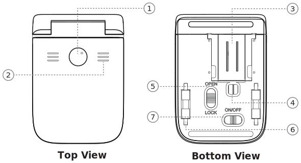

PrinCube 操作說明
======

  
 

1. 開始/停止 按鈕
2. 狀態指示
3. 打印頭
4. 光學傳感器
5. Open/Lock 開關
6. 滾輪
7. ON/OFF 開關

### 箱內物品
 - PrinCube 主機
 - 底座
 - 清潔刷
 - 標準墨盒
 - 打印輔助支架
 - 打印輔助尺 x2
 - Type-C USB 線
 - 手冊

## 基礎操作

### 安裝墨盒

1. 把墨盒從保護殼中取出，揭去噴頭保護膜；
2. 取下打印機底座，拔動倉門開關打開透明倉門；
3. 把墨盒放入打印機墨倉，捏緊倉門，並合上倉門開關。

Notes:
 - 打開和關閉倉門開關時，都需要捏緊倉門緊貼至機身
 - 若墨盒長時間不用，建議放回墨盒保護殼中保存

### 打開軟件

1. 打開打印機底部電源開關，等待 5 秒，將伴隨嘀聲進入就緒狀態。

#### 通過 WiFi 連接：

2. 用手機等設備搜尋 WiFi 找到 PrinCube-xxxx 並連接，初始密碼 12345678
3. 使用相機應用掃描底座上的二維碼，或在瀏覽器地址欄中輸入 `192.168.44.1` 或 `[fd44::1]` 打開 APP

#### 通過 USB 連接：

2. 連接 USB 到電腦
3. MacOS 和 Linux 系統無需安裝驅動，Windows 系統安裝此驅動：<a href="win_driver">win_driver</a>
4. 在瀏覽器地址欄中輸入 `192.168.88.1` 或 `[fd88::1]` 打開 APP

Notes:
 - 該地址只有 WiFi 或 USB 連接至 PrinCube 時才可以訪問
 - Android 系統若不能正常訪問該地址，請關閉自動網絡切換功能，並在彈出是否切換使用移動網絡時，忽略或選否
 - 請使用不依賴互聯網的二維碼掃描工具，或手動輸入地址
 - 軟件在 Chrome, Safari 和 Firefox 上測試可用

### 打印操作

1. 打開打印機底部電源開關，等待 5 秒，將伴隨嘀聲進入就緒狀態。
2. 把打印機放置到測試用紙上，長按鍵 1 秒自動清洗噴頭。可能需要操作多次以確保噴出完整的 3 條彩色線條。
3. 把打印機放置到待打印物體表面。
4. 單擊按鈕，綠色指示燈亮，進入打印狀態。
5. 向右滑動打印機完成打印操作，打印完成後，綠燈滅。

Notes:
 - 若噴頭較爲污糟，請推出底座中的刷子，清潔噴頭；
 - 若噴頭特別容易乾燥，請在桌面倒一點清水，取出墨盒，將噴嘴放在水中浸泡半分鐘左右。

### 軟件操作

1. 點擊 新建，進入編輯模式
2. 添加圖片或文字
3. 點擊圖片或文字可以移動、旋轉和縮放（點擊已選中文字可以重新編輯）
4. 完成素材添加後，點擊打印預覽進入截選模式
5. 點擊選擇默認截選框，選擇打印區域
6. 點擊 打印 將打印內容發送到打印機

### 按鈕操作和狀態指示
 - 開機 5 秒後進入就緒狀態，伴隨蜂鳴器提示音，中間及兩側白燈全亮；
 - 就緒狀態下，單擊按鍵進入打印狀態，兩側白燈滅、綠燈亮，若爲首行打印，響兩聲，否則響一聲。滑動打印機完成打印，打印完成伴隨提示音回到就緒狀態；
 - 就緒狀態下，長按按鍵進入清洗狀態，兩側白燈滅、綠燈亮，且低頻音提示。不需要移動打印機，稍等片刻伴隨提示音自動回到就緒狀態；
 - 打印狀態下，單擊按鍵提前結束當前打印，若爲多行打印，下次打印下一行；
 - 打印狀態下，長按按鍵提前結束當前打印，若爲多行打印，下次打印首行；
 - 按住按鍵，再打開電源開關，進入燒錄模式；
 - 先打開電源開關後，5 秒內按住按鍵，直到兩側白燈閃爍，將恢復出廠設置；

 - 打印狀態下，若移動速度過快，兩側白燈將會閃爍，伴隨高頻音提示；
 - 電量低時，中間白燈閃爍；
 - USB 接口旁爲充電指示燈，充電中爲黃色，已充滿爲綠色；

## 進階操作

### 多行打印

在截選模式下，可以添加多個選擇框。  
點擊打印時，第一個內容會有兩聲提示，其餘內容一聲提示，軟件上對應選擇框也會高亮提示。

### 多行對齊

在截選模式下，先選好第一行打印內容，然後使用向下重複功能，重複多個截選框。

### 超長打印

單個打印過長時，容易出錯，且轉換較慢，此時可以勾選截選框拼接功能，
先選擇一部分打印內容，然後使用向右重複功能，重複多個截選框。

### 軟件離線操作

1. 進入軟件設置頁面
2. 下載 https 證書並安裝
3. 點擊軟件設置頁面下方的 https 連接
4. 點擊瀏覽器選項：保存應用至桌面

Notes:
 - 軟件功能需要先在線使用一遍，才可以離線使用。

#### iOS 證書安裝方法
1. 點擊 APP 設置頁面的證書連接進行安裝
2. 前往「設定」>「已下載配置文件」> 安裝證書
3. 前往「設定」>「一般」>「關於本機」>「證書信任列表設定」。在「啟用根證書的完整信任」下，啟用該憑證的信任設定

#### Android 證書安裝方法
1. 點擊 APP 設置頁面的證書連接下載證書
2. 前往「設定」>「鎖定屏幕和安全性」>「從設備內存/SD卡安裝」> 選擇剛下載的證書文件

