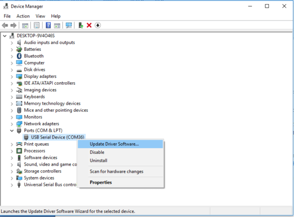
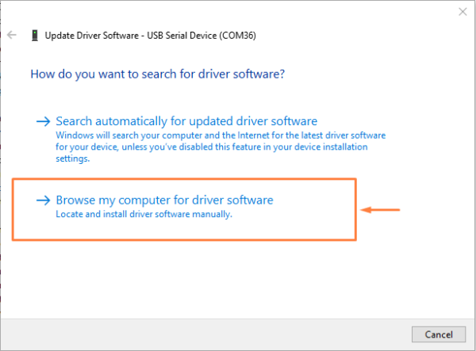
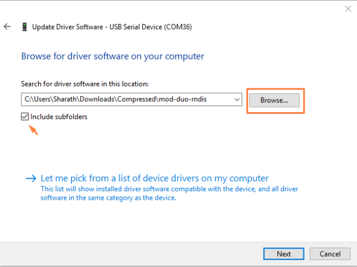
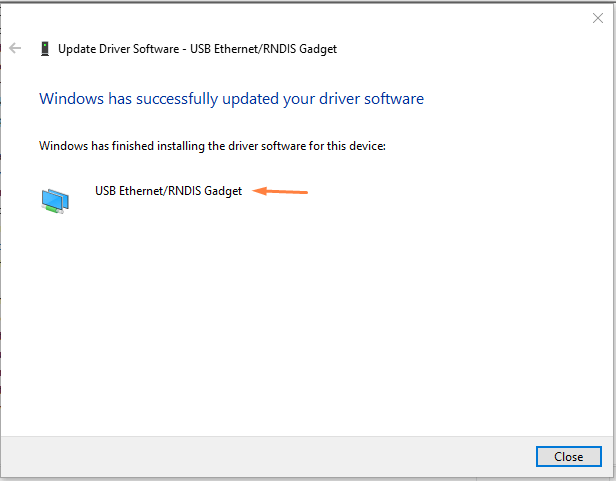

PrinCube Windows USB Driver
===========================
(No driver required for MacOS and Linux.)

Download the RNDIS Driver: <a href="mod-duo-rndis.zip">mod-duo-rndis.zip</a>, Extract the downloaded zip files.

This article is referenced from:
 - https://www.factoryforward.com/pi-zero-w-headless-setup-windows10-rndis-driver-issue-resolved/
 - https://forum.moddevices.com/t/rndis-driver-for-windows-10/299

Open Device Manager and you can see the PrinCube is detected as USB Serial Device at COM port under the PORTS & LPT. Right click on it and select “Update Driver Software”.

  
 

Select ‘Browse my computer for driver software’.

  
 

Choose the location where you extracted the driver files on your PC.

  

  
 

Now you can able to see the PrinCube as RNDIS in Network adapters.

